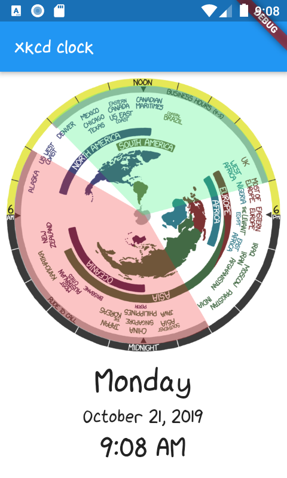

# xkcd_clock

A Flutter implementation of [the xkcd clock](https://xkcd.com/now). Added wedges to display what times are business hours (green) and what times are rude to call (red). Also wanted to see how hard it is to implement this in Flutter. Took more time to generate the PNG than adding it to the code and testing.

## Screenshot

